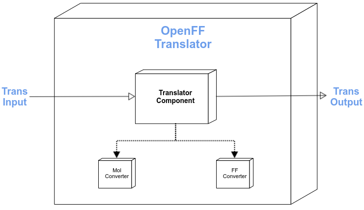

[//]: # (Badges)
[](https://github.com/MolSSI/mmic_openff/actions?query=workflow%3ACI)
[](https://codecov.io/gh/MolSSI/mmic_openff/branch/main)
[](https://lgtm.com/projects/g/MolSSI/mmic_openff/context:python)

OpenFF translator for MMSchema
==============================
This is part of the [MolSSI](http://molssi.org) Molecular Mechanics Interoperable Components ([MMIC](https://github.com/MolSSI/mmic)) project. This package provides translators between [MMSchema](https://molssi.github.io/mmschema) and [OpenFF](https://github.com/openforcefield/openff-toolkit) toolkit.



**mmic_openff** provides 2 classes of translators for: molecules and forcefields.

# Models
```python
from mmic_openff.models import OpenFFMol

# Convert MMSchema to OpenFF molecule
off_mol = OpenFFMol.from_schema(mm_mol) -> 

# Convert OpenFF to MMSchema molecule
mm_mol = OpenFFMol.to_schema(off_mol) -> mmelemental.models.Molecule

```
One could do similar conversions for the `ForceField` model as well.

# Components
The `from_schema` and `to_schema` methods in the `OpenFFMol` model use translation components provided by **mmic_openff** and **MMElemental** to convert between MMSchema and OpenFF representations.

```python
from mmic_openff.components import OpenFFToMolComponent, MolToOpenFFComponent
from mmic_openff.models.import OpenFFMol
from mmelemental.models import Molecule
```

## MMSchema to OpenFF molecule
```python
# Create MMSchema molecule
mm_mol = Molecule.from_file(path_to_file)

# Create translation input
inp = {
    "schema_object": mm_mol,
    "schema_version": 1,
    "schema_name": "mmschema",
}

# Run translator compute
outp = MolToOpenFFComponent.compute(inp)

# Extract OpenFF molecule object
mol = outp.data_object.data
```

## OpenFF to MMSchema molecule
```python
from simtk.openmm import app

# Create OpenFF input

...

# Create translation input
inp = {
    "data_object": ommol,
    "schema_version": 1,
    "schema_name": "mmschema",
}

# Running translator compute
outp = Translator.compute(inp)

# Extract MMSchema molecule
mm_mol = outp.schema_object
```
One could do similar conversions with the force field component as well.

### Copyright
Copyright (c) 2021, MolSSI


#### Acknowledgements
 
Project based on the 
[Computational Molecular Science Python Cookiecutter](https://github.com/molssi/cookiecutter-cms) version 1.5.
